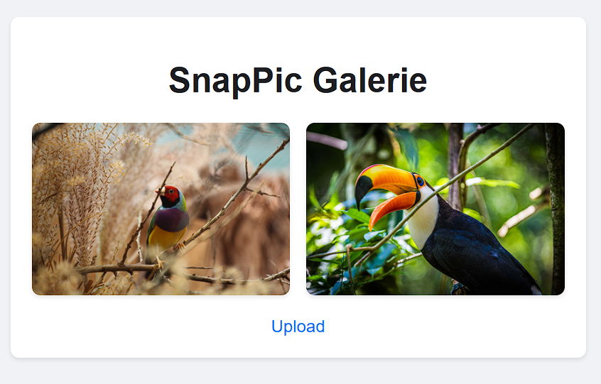

# SnapPic

SnapPic is a simple web application for sharing ephemeral images. Users can upload photos either from their local files or directly from their camera, add a short comment, and share them in a gallery. Images in the gallery have a limited lifetime and will automatically fade out and be deleted after a set period.

## Features

*   **Image Upload:** Upload images from your device.
*   **Camera Capture:** Take photos directly using your device's camera.
*   **Comments:** Add a short comment to each uploaded image.
*   **Ephemeral Gallery:** Images are displayed in a gallery and automatically disappear after a set time.

## Screenshots

### Upload Page (Index)

### Gallery Page

## Development

This project was created with the Gemini CLI using the `gemini-2.5-pro` and `gemini-2.5-flash` Large Language Models.
